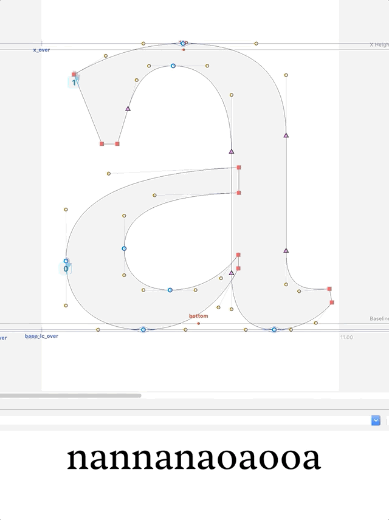

# Margin Selection
A start-up script that allows you to select the margins as if you would any point or segment. 
Click on the side bearing and move it with the mouse or arrows!

**Ryan Bugden and Bahman Eslami**  
with thanks to Erik van Blokland and Frederik Berlaen.

## To do:
* Clicking on points and a SB + dragging isn't fully solved yet. If you then click and drag mouse from the SB after making the selection, the points of deselected. If you click and drag from points, it works, but holding down `Shift` (to keep things from moving vertically) will kill the action.
* Selecting the sidebearing by means of marqueeing over it seems a bit too invasive, as one may want to marquee over just points, and many people are loose with their marquees! Also, points may be beyond SB. Perhaps margin should only be able to be selected if clicked directly, as the user should be sure what they're about to do.
* Margin selection line thickness seems to be too thick when zoomed in. Should double-check `notification['scale']` or something of the like.


```
v0.2.0:   2020.03.31  Bahman worked some magic.
v0.1.5:   2019.12.20  
v0.1.1:   2019.04.10  
v0.1.0:   2019.03.07  Initial push.
```

